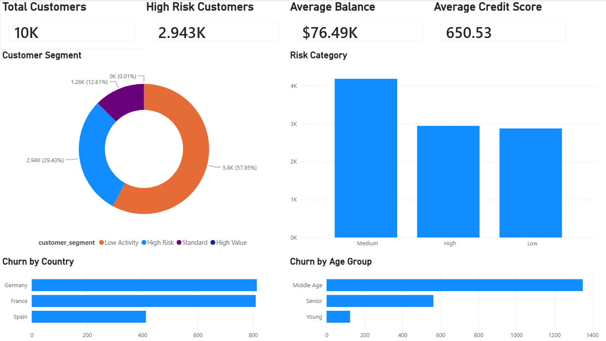
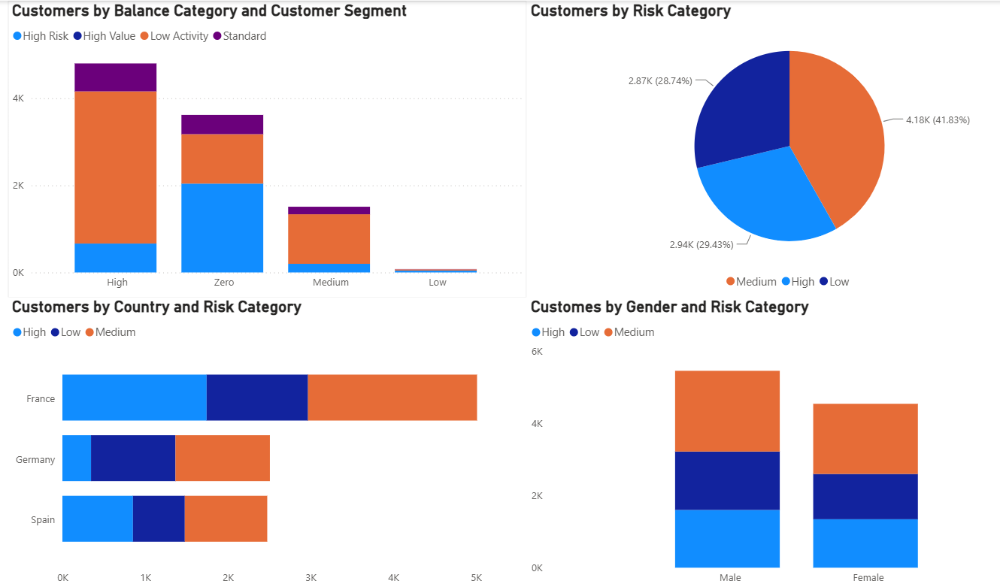
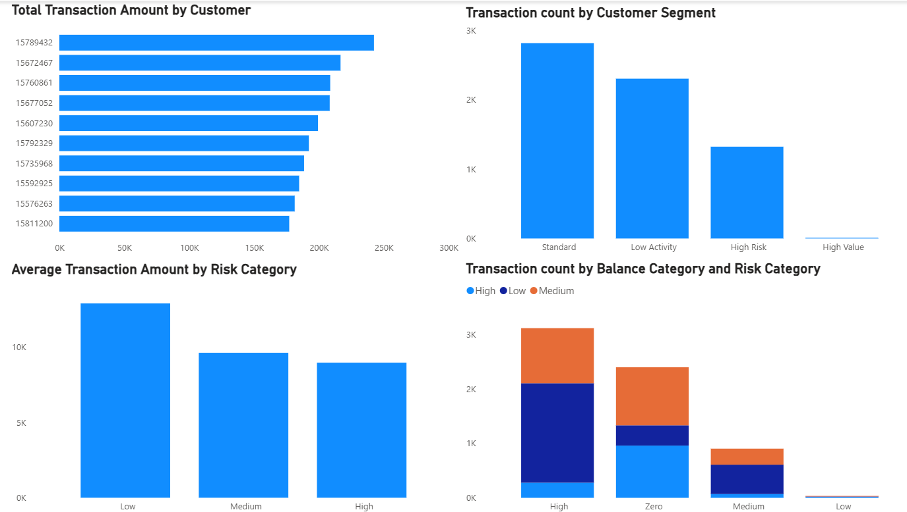

# Banking Customer Churn & Risk Analytics Pipeline

## Project Overview

This project demonstrates an end-to-end Data Engineering and Analytics solution using PySpark, Delta Lake, Structured Streaming, and Power BI.

Customer and transaction data are processed through Bronze, Silver, and Gold layers to generate business insights, customer segmentation, and risk analytics dashboards.

---

## Tech Stack

- PySpark
- Python
- Databricks Community Edition
- Delta Lake
- Structured Streaming
- Power BI

---

## Pipeline Flow

Raw Data
↓
Bronze Layer
↓
Silver Layer
↓
Gold Layer
↓
Power BI Dashboard

---

## Medallion Architecture

### Bronze Layer
- Raw customer data
- Raw transaction data

### Silver Layer
- Cleaned customer data
- Aggregated transaction metrics

### Gold Layer
- Customer risk scoring
- Customer segmentation
- Business KPIs

---

## Structured Streaming

Simulated streaming transactions were generated and processed using PySpark Structured Streaming with checkpointing.

---

## Key Features

- Medallion Architecture
- Delta Lake
- Structured Streaming
- Customer Risk Scoring
- Customer Segmentation
- Power BI Dashboard

---

## Dashboard Screenshots

### Executive Overview



### Customer Risk Analytics



### Transaction Analytics



---

## Repository Structure

```text
banking-churn-pipeline/
│
├── notebooks/
├── screenshots/
├── powerbi/
├── sample_data/
└── README.md
```
